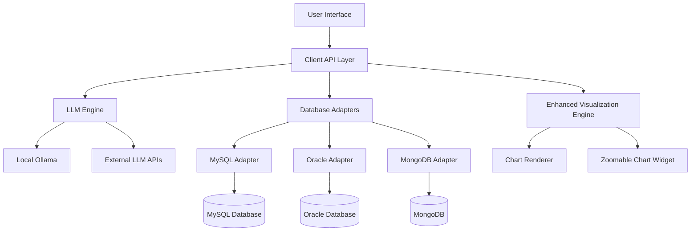

# 🚀 InsightPilot

> **AI-Powered Data Explorer** - Transform your natural language questions into powerful database insights with zero SQL knowledge required.

[](https://python.org)
[](https://doc.qt.io/qtforpython/)
[](LICENSE)
[]()

## ✨ What is InsightPilot?

InsightPilot revolutionizes how you interact with your data. Simply ask questions in plain English, and watch as our AI transforms them into precise SQL queries, executes them safely, and presents beautiful visualizations—all without writing a single line of code.

### 🎯 Perfect For
- **Business Analysts** who need quick data insights
- **Non-technical users** who want to explore databases
- **Data teams** looking to democratize data access
- **Anyone** who prefers asking questions over writing queries

---

## � Key Features

### 🧠 **Intelligent Query Generation**
- **Natural Language Processing**: Ask questions like "Show me sales trends for the last quarter"
- **Multi-Database Support**: MySQL, Oracle, MongoDB—all in one interface
- **Smart Schema Analysis**: Automatically understands your database structure
- **Query Validation**: Built-in safety checks prevent dangerous operations

### 📊 **Advanced Visualizations with Zoom**
- **Interactive Charts**: Bar, line, pie, scatter, and histogram charts
- **Zoom & Pan**: Enhanced chart viewer with smooth zoom functionality (NEW! 🔍)
- **AI-Recommended Charts**: Let AI suggest the best visualization for your data
- **Export Options**: Save charts as high-resolution images (PNG, JPEG, PDF)

### 🎨 **Modern, Clean Interface**
- **Intuitive Design**: Clean, professional interface that's easy to navigate (ENHANCED! ✨)
- **Tabbed Workflow**: Organize your work across multiple tabs
- **Real-time Progress**: See exactly what's happening during query execution
- **Enhanced Styling**: Modern design with improved visual hierarchy

### 🔒 **Enterprise-Ready Security**
- **Secure Connections**: Encrypted database connections
- **Query Sanitization**: Prevents SQL injection attacks
- **Access Control**: Configurable database permissions
- **Audit Trail**: Complete query history and logging

---

## 🏗️ Architecture Overview



### 🎭 Deployment Modes

| Mode | Description | Use Case |
|------|-------------|----------|
| **🖥️ Standalone** | Complete local installation with Ollama LLM | Personal use, small teams |
| **👥 Client** | Connect to remote InsightPilot server | Enterprise deployments |
| **⚡ Server** | Headless server for multiple clients | Data centers, cloud deployments |

---

## 🚀 Quick Start

### 📋 Prerequisites

- **Python 3.8+** installed on your system
- **Database access** to MySQL, Oracle, or MongoDB
- **4GB RAM** minimum (8GB recommended for local LLM)

### ⚡ Installation

1. **Clone the repository**
   ```bash
   git clone https://github.com/yourusername/InsightPilot.git
   cd InsightPilot
   ```

2. **Install dependencies**
   ```bash
   pip install -r requirements.txt
   ```

3. **Run InsightPilot**
   ```bash
   python run_insightpilot.py
   ```

### 🎯 First Steps

1. **Add Database Connection**
   - Open the "Connections" tab
   - Click "New Connection"
   - Enter your database details
   - Test the connection

2. **Ask Your First Question**
   - Go to "Query Chat" tab
   - Type: "Show me all customers from last month"
   - Watch the magic happen! ✨

3. **Explore Your Data**
   - View results in the interactive table
   - Switch to chart view for visualizations
   - Use zoom controls to examine details (NEW! 🔍)
   - Export data or save charts

---

## 🆕 What's New in v1.1.0

### 🔍 **Enhanced Chart Zoom & Interaction**
- **Mouse Wheel Zoom**: Ctrl + scroll for smooth zooming (10% - 500%)
- **Zoom Toolbar**: Precise zoom controls with in/out, fit-to-view, and reset
- **Pan Support**: Click and drag to navigate around zoomed charts
- **High-Quality Rendering**: Crystal-clear charts at any zoom level

### 💾 **Improved Export Capabilities**
- **Data Export**: Save query results to CSV or Excel formats
- **Chart Export**: High-resolution image export (PNG, JPEG, PDF)
- **Professional Quality**: 300 DPI exports perfect for presentations

### 🎨 **Modern UI Enhancements**
- **Enhanced Styling**: Professional color schemes and gradients
- **Better Typography**: Improved fonts and visual hierarchy
- **Responsive Design**: Better scaling across different screen sizes
- **Color-Coded Actions**: Intuitive button styling for different operations

---

## 📚 Documentation

### 📖 **Complete Guides**
- **[📘 User Guide](docs/USER_GUIDE.md)** - Comprehensive usage instructions
- **[🔧 API Reference](docs/API_REFERENCE.md)** - Technical documentation for developers
- **[🛠️ Troubleshooting](docs/TROUBLESHOOTING.md)** - Solutions for common issues
- **[📋 Changelog](CHANGELOG.md)** - Track all changes and improvements

### 🎯 **Quick References**
- **Database Connection Setup**: See [User Guide - Database Connections](docs/USER_GUIDE.md#database-connections)
- **Chart Zoom Usage**: See [User Guide - Chart Zoom & Interaction](docs/USER_GUIDE.md#chart-zoom--interaction)
- **Export Functions**: See [User Guide - Exporting Data](docs/USER_GUIDE.md#exporting-data)
- **Performance Tips**: See [Troubleshooting - Performance Issues](docs/TROUBLESHOOTING.md#performance-issues)

---

## 🛠️ Configuration

### 🗄️ Database Connections

InsightPilot supports multiple database types with simple configuration:

#### MySQL Connection
```json
{
  "name": "production_db",
  "type": "mysql",
  "host": "localhost",
  "port": 3306,
  "database": "sales_data",
  "username": "your_username",
  "password": "encrypted_password"
}
```

#### Oracle Connection
```json
{
  "name": "oracle_hr",
  "type": "oracle",
  "host": "oracle.company.com",
  "port": 1521,
  "database": "HR",
  "username": "hr_user",
  "password": "encrypted_password"
}
```

### 🤖 LLM Configuration

Configure your AI engine for optimal performance:

- **Local Ollama**: Runs entirely on your machine
- **OpenAI GPT**: Connect to OpenAI's powerful models
- **Custom APIs**: Integrate with your organization's LLM services

---

## 🎨 UI Features & Controls

### 📊 **Chart Zoom Controls**
- **🔍+ Zoom In**: Increase magnification by 10%
- **🔍- Zoom Out**: Decrease magnification by 10%
- **⊡ Fit to View**: Auto-fit chart to window size
- **1:1 Reset**: Return to 100% zoom
- **Zoom Slider**: Precise zoom control (10% - 500%)

### 💾 **Export Options**
- **📊 Export Data**: Save results as CSV or Excel files
- **📸 Save Chart**: Export charts as high-resolution images
- **🖼️ Multiple Formats**: PNG, JPEG, PDF support
- **📐 Custom Sizing**: Configurable resolution and dimensions

---

## 🤝 Contributing

We welcome contributions from the community! Here's how you can help:

### 🐛 **Report Issues**
Found a bug? [Open an issue](https://github.com/yourusername/InsightPilot/issues) with:
- Clear description of the problem
- Steps to reproduce
- Your system information
- Screenshots if applicable

### 💡 **Suggest Features**
Have an idea? We'd love to hear it! Open a feature request with:
- Detailed description of the feature
- Use cases and benefits
- Mockups or examples if available

### 🔧 **Code Contributions**
1. Fork the repository
2. Create a feature branch
3. Make your changes with tests
4. Submit a pull request

---

## 🆘 Support

### 📖 **Documentation**
- [📘 User Guide](docs/USER_GUIDE.md)
- [🔧 API Reference](docs/API_REFERENCE.md)
- [🛠️ Troubleshooting](docs/TROUBLESHOOTING.md)

### 💬 **Community**
- [GitHub Discussions](https://github.com/yourusername/InsightPilot/discussions)
- [Discord Server](https://discord.gg/insightpilot)
- [Stack Overflow](https://stackoverflow.com/questions/tagged/insightpilot)

### 🐞 **Bug Reports**
- [Issue Tracker](https://github.com/yourusername/InsightPilot/issues)
- [Security Issues](mailto:security@insightpilot.com)

---

## 📜 License

This project is licensed under the MIT License - see the [LICENSE](LICENSE) file for details.

---

## 🙏 Acknowledgments

- **Ollama Team** for the amazing local LLM engine
- **Qt/PySide** for the powerful GUI framework
- **Matplotlib** for beautiful data visualizations
- **Our Community** for feedback, bug reports, and contributions

---

## 🚀 What's Next?

### 🛣️ Roadmap

- **🎯 Q1 2025**: Enhanced AI models, more chart types
- **📱 Q2 2025**: Web interface, mobile app
- **🌐 Q3 2025**: Cloud deployment, collaboration features
- **🔮 Q4 2025**: Advanced analytics, machine learning integration

### 📊 **Current Status**


---

<div align="center">

**Made with ❤️ by the InsightPilot team**

**📚 [Documentation](docs/) | 🐛 [Issues](https://github.com/yourusername/InsightPilot/issues) | 💬 [Discussions](https://github.com/yourusername/InsightPilot/discussions)**

[⬆ Back to top](#-insightpilot)

</div>

## 🔌 Database Adapters

* **MySQL**:
  * `mysql-connector-python` (schema, query execution)
* **Oracle**:
  * `cx_Oracle` or `oracledb` (with Oracle Instant Client)
* **MongoDB**:
  * `pymongo` (aggregations, schema sampled from collections)

Each adapter:
* Extracts metadata (`tables`, `columns`, `types`)
* Runs generated queries/aggregations
* Sanitizes and validates user input where needed

## 📊 Visualization Layer

* Embedded **chart rendering** using:
  * `Matplotlib` (inside  PySide UI)
  * Supports: `bar`, `line`, `pie`, `scatter`, `table`
* Data type ↔ chart mapping inferred:
  * Time series → line chart
  * Categorical + count → bar/pie
* Users can override suggestions via UI dropdown

## 🔐 Configuration + Security

* Config stored in encrypted file (AES-256)
* Windows Credential Store used to decrypt key material
* Only schema metadata is cached, no raw data persisted
* Query limits enforced: max 1000 rows or 24h time window
* Cluster nodes use mutual TLS (optional for server mode)

## 🧱 Implementation Steps

### 1. 🧩 Desktop App with  PySide
Build a multi-tabbed PyQt app with panels for:
- **Connection Config** (DB management)
- **Chat Interface** (question input and LLM response)
- **Chart/Results Viewer**
- Use `QTableView` for tabular result rendering

### 2. 🔐 Secure Config File
- Use `keyring` to store encryption keys securely via Windows Credential Store
- Serialize DB connection configs (host, port, db, user) to encrypted JSON file

### 3. 🔌 DB Adapter Layer (Python modules)
Create a pluggable adapter structure:

```python
class BaseDBAdapter:
    def connect(self): ...
    def get_schema(self): ...
    def execute_query(self, sql): ...
```

Implement:
- `MySQLAdapter` using `mysql-connector-python`
- `OracleAdapter` using `oracledb`
- `MongoAdapter` using `pymongo`

### 4. 🧠 LLM Integration via Ollama
Use `requests` to communicate with local Ollama REST API:
- `POST` structured prompt to `/api/generate`
- Return SQL output
- Prompt template:
```plaintext
### DB SCHEMA ###
Table: orders
Columns: id, status, created_at

### USER QUESTION ###
show pending orders in last 24 hours

### SQL OUTPUT ###
```

### 5. ⚙️ App Modes (CLI Flags or Settings)
On startup, choose from:
- `--mode=standalone` – launches desktop UI + Ollama + adapters locally
- `--mode=client` – opens desktop UI that connects to remote gRPC server
- `--mode=server` – headless mode: launches LLM + DB adapters + gRPC interface (no UI)
- gRPC used for client-server request handling

### 6. 📊 Result Visualization
Use `Matplotlib` to render:
- Bar, pie, line charts
- Infer chart types based on result shape (e.g., timestamps → line chart)

### 7. 📝 History, Export, and Safeguards
**Local SQLite file for:**
- Query logs
- User favorites

**Export:**
- Table as CSV
- Chart as PNG

**Validate generated SQL for safety (deny DDL/DML)**

## 🎯 Milestones

| # | Title | Description | Status | Achieved | Contributor |
|---|-------|-------------|--------|----------|-------------|
| M1 | Project Scaffolding & CLI Modes | Set up Python project with CLI entry point, flags for `standalone`, `client`, `server` modes | ☐ | - | - |
| M2 | PyQt UI Skeleton | Basic layout: config form, chat input box, results panel | ☐ | - | - |
| M3 | Config Storage with Encryption | Secure config file storage using `keyring` + JSON | ☐ | - | - |
| M4 | DB Adapters (MySQL, Oracle, Mongo) | Implement schema reader + query runner interfaces for all 3 DB types | ☐ | - | - |
| M5 | LLM Integration via Ollama | Local prompt builder + query generation via REST calls to Ollama | ☐ | - | - |
| M6 | Query Execution & Validation | Validate LLM-generated SQL/aggregation queries, show previews | ☐ | - | - |
| M7 | Charting Module with Matplotlib | Auto-infer chart types, render visual output inside the app | ☐ | - | - |
| M8 | Local History and Export | SQLite for query history; export charts and tables | ☐ | - | - |
| M9 | Server-Only + Client Mode (gRPC) | Implement server-side LLM+adapter gRPC APIs and client communication | ☐ | - | - |
| M10 | Testing, Packaging, and MVP Release | Wrap-up, unit tests, package with PyInstaller for distribution | ☐ | - | - |

### Milestone Progress Legend
- ☐ Not Started
- 🔄 In Progress  
- ✅ Completed
- ⚠️ Blocked

**Note**: Update the Status column with appropriate emoji, add achievement date (YYYY-MM-DD format), and contributor name when milestones are completed.
