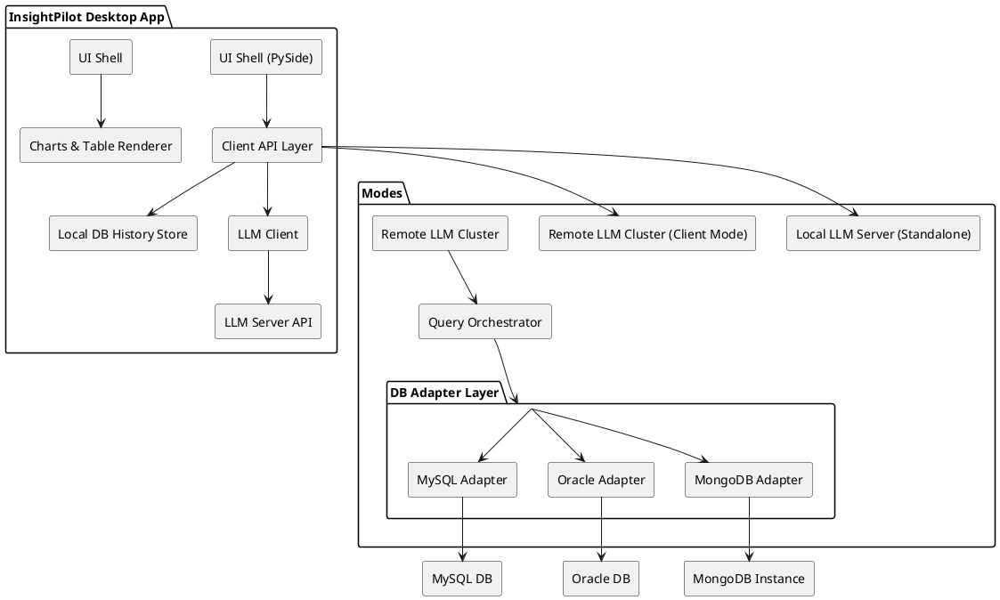

# InsightPilot

InsightPilot is an intelligent, AI-powered solution that lets you explore and analyze your data—no SQL required. It transforms natural language into deep insights, making data querying effortless and intuitive.

## 🏗️ Architecture



## 🛠️ Tech Stack

| Component | Tech Stack / Tool |
|-----------|------------------|
| UI Framework |   PySide |
| Charting Library | Matplotlib |
| Backend (App Logic) | Python |
| LLM Engine | Ollama with Mistral 7B model |
| Database Clients | mysql-connector-python, oracledb, pymongo |
| IPC/Comms | gRPC for local client-server comms |
| Encryption Store | keyring or Windows DPAPI |

## 🔄 Launch Modes

* **Standalone Mode (default)**:
  * Starts LLM server locally (Ollama with Mistral 7B)
  * Embeds driver + UI together
* **Client Mode**:
  * UI-only app that connects to a known server node/cluster
  * Uses TCP/WebSocket for communication
* **Server Mode**:
  * Headless cluster node exposing:
    * LLM engine
    * DB adapters (read schemas, run queries)
  * Supports clustering for HA/failover

## 🧠 LLM Integration

* **Model**: `Mistral 7B` via **Ollama** running locally
* **Prompt Pipeline**:
  1. Schema extraction (example: table names, columns, types)
  2. Natural language input: *"show pending orders in last 24 hours"*
  3. Prompt structure:
     ```plaintext
     ### SCHEMA ###
     Table: orders
     Columns: id, status, created_at, ...

     ### QUESTION ###
     show pending orders in last 24 hours

     ### SQL ###
     ```
  4. SQL output validated before execution

## 🔌 Database Adapters

* **MySQL**:
  * `mysql-connector-python` (schema, query execution)
* **Oracle**:
  * `cx_Oracle` or `oracledb` (with Oracle Instant Client)
* **MongoDB**:
  * `pymongo` (aggregations, schema sampled from collections)

Each adapter:
* Extracts metadata (`tables`, `columns`, `types`)
* Runs generated queries/aggregations
* Sanitizes and validates user input where needed

## 📊 Visualization Layer

* Embedded **chart rendering** using:
  * `Matplotlib` (inside  PySide UI)
  * Supports: `bar`, `line`, `pie`, `scatter`, `table`
* Data type ↔ chart mapping inferred:
  * Time series → line chart
  * Categorical + count → bar/pie
* Users can override suggestions via UI dropdown

## 🔐 Configuration + Security

* Config stored in encrypted file (AES-256)
* Windows Credential Store used to decrypt key material
* Only schema metadata is cached, no raw data persisted
* Query limits enforced: max 1000 rows or 24h time window
* Cluster nodes use mutual TLS (optional for server mode)

## 🧱 Implementation Steps

### 1. 🧩 Desktop App with  PySide
Build a multi-tabbed PyQt app with panels for:
- **Connection Config** (DB management)
- **Chat Interface** (question input and LLM response)
- **Chart/Results Viewer**
- Use `QTableView` for tabular result rendering

### 2. 🔐 Secure Config File
- Use `keyring` to store encryption keys securely via Windows Credential Store
- Serialize DB connection configs (host, port, db, user) to encrypted JSON file

### 3. 🔌 DB Adapter Layer (Python modules)
Create a pluggable adapter structure:

```python
class BaseDBAdapter:
    def connect(self): ...
    def get_schema(self): ...
    def execute_query(self, sql): ...
```

Implement:
- `MySQLAdapter` using `mysql-connector-python`
- `OracleAdapter` using `oracledb`
- `MongoAdapter` using `pymongo`

### 4. 🧠 LLM Integration via Ollama
Use `requests` to communicate with local Ollama REST API:
- `POST` structured prompt to `/api/generate`
- Return SQL output
- Prompt template:
```plaintext
### DB SCHEMA ###
Table: orders
Columns: id, status, created_at

### USER QUESTION ###
show pending orders in last 24 hours

### SQL OUTPUT ###
```

### 5. ⚙️ App Modes (CLI Flags or Settings)
On startup, choose from:
- `--mode=standalone` – launches GUI + Ollama + adapters
- `--mode=client` – connects to remote gRPC server
- `--mode=server` – launches LLM + DB adapters + gRPC interface
- gRPC used for client-server request handling

### 6. 📊 Result Visualization
Use `Matplotlib` to render:
- Bar, pie, line charts
- Infer chart types based on result shape (e.g., timestamps → line chart)

### 7. 📝 History, Export, and Safeguards
**Local SQLite file for:**
- Query logs
- User favorites

**Export:**
- Table as CSV
- Chart as PNG

**Validate generated SQL for safety (deny DDL/DML)**

## 🎯 Milestones

| # | Title | Description | Status | Achieved | Contributor |
|---|-------|-------------|--------|----------|-------------|
| M1 | Project Scaffolding & CLI Modes | Set up Python project with CLI entry point, flags for `standalone`, `client`, `server` modes | ☐ | - | - |
| M2 | PyQt UI Skeleton | Basic layout: config form, chat input box, results panel | ☐ | - | - |
| M3 | Config Storage with Encryption | Secure config file storage using `keyring` + JSON | ☐ | - | - |
| M4 | DB Adapters (MySQL, Oracle, Mongo) | Implement schema reader + query runner interfaces for all 3 DB types | ☐ | - | - |
| M5 | LLM Integration via Ollama | Local prompt builder + query generation via REST calls to Ollama | ☐ | - | - |
| M6 | Query Execution & Validation | Validate LLM-generated SQL/aggregation queries, show previews | ☐ | - | - |
| M7 | Charting Module with Matplotlib | Auto-infer chart types, render visual output inside the app | ☐ | - | - |
| M8 | Local History and Export | SQLite for query history; export charts and tables | ☐ | - | - |
| M9 | Server-Only + Client Mode (gRPC) | Implement server-side LLM+adapter gRPC APIs and client communication | ☐ | - | - |
| M10 | Testing, Packaging, and MVP Release | Wrap-up, unit tests, package with PyInstaller for distribution | ☐ | - | - |

### Milestone Progress Legend
- ☐ Not Started
- 🔄 In Progress  
- ✅ Completed
- ⚠️ Blocked

**Note**: Update the Status column with appropriate emoji, add achievement date (YYYY-MM-DD format), and contributor name when milestones are completed.
