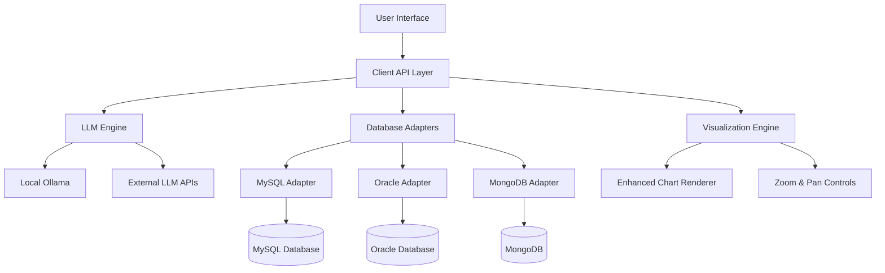

# 🚀 InsightPilot

> **AI-Powered Data Explorer** - Transform your natural language questions into powerful database insights with zero SQL knowledge required.

[](https://python.org)
[](https://doc.qt.io/qtforpython/)
[](LICENSE)
[]()

## ✨ What is InsightPilot?

InsightPilot revolutionizes how you interact with your data. Simply ask questions in plain English, and watch as our AI transforms them into precise SQL queries, executes them safely, and presents beautiful visualizations—all without writing a single line of code.

### 🎯 Perfect For
- **Business Analysts** who need quick data insights
- **Non-technical users** who want to explore databases
- **Data teams** looking to democratize data access
- **Anyone** who prefers asking questions over writing queries

---

## 🌟 Key Features

### 🧠 **Intelligent Query Generation**
- **Natural Language Processing**: Ask questions like "Show me sales trends for the last quarter"
- **Multi-Database Support**: MySQL, Oracle, MongoDB—all in one interface
- **Smart Schema Analysis**: Automatically understands your database structure
- **Query Validation**: Built-in safety checks prevent dangerous operations

### 📊 **Advanced Visualizations with Zoom**
- **Interactive Charts**: Bar, line, pie, scatter, and histogram charts
- **Zoom & Pan**: Enhanced chart viewer with smooth zoom functionality
- **AI-Recommended Charts**: Let AI suggest the best visualization for your data
- **Export Options**: Save charts as high-resolution images (PNG, JPEG, PDF)

### 🎨 **Modern, Clean Interface**
- **Intuitive Design**: Clean, professional interface that's easy to navigate
- **Tabbed Workflow**: Organize your work across multiple tabs
- **Real-time Progress**: See exactly what's happening during query execution
- **Dark/Light Themes**: Choose the theme that works best for you

### 🔒 **Enterprise-Ready Security**
- **Secure Connections**: Encrypted database connections
- **Query Sanitization**: Prevents SQL injection attacks
- **Access Control**: Configurable database permissions
- **Audit Trail**: Complete query history and logging

---

## 🏗️ Architecture Overview



### 🎭 Deployment Modes

| Mode | Description | Use Case |
|------|-------------|----------|
| **🖥️ Standalone** | Complete local installation with Ollama LLM | Personal use, small teams |
| **👥 Client** | Connect to remote InsightPilot server | Enterprise deployments |
| **⚡ Server** | Headless server for multiple clients | Data centers, cloud deployments |

---

## 🚀 Quick Start

### 📋 Prerequisites

- **Python 3.8+** installed on your system
- **Database access** to MySQL, Oracle, or MongoDB
- **4GB RAM** minimum (8GB recommended for local LLM)

### ⚡ Installation

1. **Clone the repository**
   ```bash
   git clone https://github.com/yourusername/InsightPilot.git
   cd InsightPilot
   ```

2. **Install dependencies**
   ```bash
   pip install -r requirements.txt
   ```

3. **Run InsightPilot**
   ```bash
   python run_insightpilot.py
   ```

### 🎯 First Steps

1. **Add Database Connection**
   - Open the "Connections" tab
   - Click "New Connection"
   - Enter your database details
   - Test the connection

2. **Ask Your First Question**
   - Go to "Query Chat" tab
   - Type: "Show me all customers from last month"
   - Watch the magic happen! ✨

3. **Explore Your Data**
   - View results in the interactive table
   - Switch to chart view for visualizations
   - Use zoom controls to examine details
   - Export data or save charts

---

## 📱 User Interface Guide

### 🏠 Main Window Components

#### 📊 **Visualization Controls**
- **Chart Type Selector**: Choose from bar, line, pie, scatter, histogram
- **AI Recommendations**: Get smart chart suggestions based on your data
- **Chart Hints**: Provide natural language hints for custom visualizations
- **Export Tools**: Save data to CSV/Excel or charts as images

#### 🔍 **Enhanced Chart Viewer**
- **Zoom Controls**: 
  - Mouse wheel + Ctrl for smooth zooming
  - Toolbar buttons for precise control
  - Zoom slider for exact percentages
  - Fit-to-view and reset options
- **Pan Support**: Click and drag to pan around zoomed charts
- **High Resolution**: Crystal-clear charts at any zoom level

#### 📋 **Data Tables**
- **Sortable Columns**: Click headers to sort data
- **Search & Filter**: Find specific records quickly
- **Alternating Rows**: Easy-to-read striped layout
- **Resize Columns**: Adjust column widths as needed

---

## 🛠️ Configuration

### 🗄️ Database Connections

InsightPilot supports multiple database types with simple configuration:

#### MySQL Connection
```json
{
  "name": "production_db",
  "type": "mysql",
  "host": "localhost",
  "port": 3306,
  "database": "sales_data",
  "username": "your_username",
  "password": "encrypted_password"
}
```

#### Oracle Connection
```json
{
  "name": "oracle_hr",
  "type": "oracle",
  "host": "oracle.company.com",
  "port": 1521,
  "database": "HR",
  "username": "hr_user",
  "password": "encrypted_password"
}
```

#### MongoDB Connection
```json
{
  "name": "analytics_mongo",
  "type": "mongodb",
  "host": "mongo.company.com",
  "port": 27017,
  "database": "analytics",
  "username": "analyst",
  "password": "encrypted_password"
}
```

### 🤖 LLM Configuration

Configure your AI engine for optimal performance:

- **Local Ollama**: Runs entirely on your machine
- **OpenAI GPT**: Connect to OpenAI's powerful models
- **Custom APIs**: Integrate with your organization's LLM services

---

## 🎨 Customization

### 🎭 Themes and Styling

InsightPilot comes with beautiful, modern themes:

- **Light Theme**: Clean, professional look for office environments
- **Dark Theme**: Easy on the eyes for extended use
- **High Contrast**: Accessibility-focused design
- **Custom Themes**: Modify CSS stylesheets for brand alignment

### 🔧 Advanced Configuration

```yaml
# config.yaml
ui:
  theme: "enhanced"
  font_size: 11
  show_animations: true
  
database:
  connection_timeout: 30
  query_timeout: 300
  
llm:
  provider: "ollama"
  model: "mistral:7b"
  temperature: 0.1
```

---

## 📚 Advanced Features

### 🔄 Query History & Favorites

- **Smart History**: All queries are automatically saved
- **Favorite Queries**: Star important queries for quick access
- **Search History**: Find past queries instantly
- **Export History**: Save your query history for documentation

### 📊 Chart Customization

- **AI-Powered Suggestions**: "Show this as a pie chart"
- **Custom Styling**: Modify colors, labels, and formatting
- **Multiple Chart Types**: Switch between visualizations instantly
- **Interactive Features**: Hover tooltips, clickable legends

### 🔐 Security Features

- **Encrypted Storage**: All passwords are securely encrypted
- **Query Validation**: Prevents dangerous SQL operations
- **Audit Logging**: Complete trail of all activities
- **Role-Based Access**: Configure user permissions

---

## 🤝 Contributing

We welcome contributions from the community! Here's how you can help:

### 🐛 **Report Issues**
Found a bug? [Open an issue](https://github.com/yourusername/InsightPilot/issues) with:
- Clear description of the problem
- Steps to reproduce
- Your system information
- Screenshots if applicable

### 💡 **Suggest Features**
Have an idea? We'd love to hear it! Open a feature request with:
- Detailed description of the feature
- Use cases and benefits
- Mockups or examples if available

### 🔧 **Code Contributions**
1. Fork the repository
2. Create a feature branch
3. Make your changes with tests
4. Submit a pull request

### 📝 **Documentation**
Help improve our documentation:
- Fix typos or unclear sections
- Add examples and tutorials
- Translate to other languages

---

## 🆘 Support

### 📖 **Documentation**
- [User Guide](docs/user-guide.md)
- [API Reference](docs/api-reference.md)
- [Troubleshooting](docs/troubleshooting.md)
- [FAQ](docs/faq.md)

### 💬 **Community**
- [GitHub Discussions](https://github.com/yourusername/InsightPilot/discussions)
- [Discord Server](https://discord.gg/insightpilot)
- [Stack Overflow](https://stackoverflow.com/questions/tagged/insightpilot)

### 🐞 **Bug Reports**
- [Issue Tracker](https://github.com/yourusername/InsightPilot/issues)
- [Security Issues](mailto:security@insightpilot.com)

---

## 📜 License

This project is licensed under the MIT License - see the [LICENSE](LICENSE) file for details.

---

## 🙏 Acknowledgments

- **Ollama Team** for the amazing local LLM engine
- **Qt/PySide** for the powerful GUI framework
- **Matplotlib** for beautiful data visualizations
- **Our Community** for feedback, bug reports, and contributions

---

## 🚀 What's Next?

### 🛣️ Roadmap

- **🎯 Q1 2025**: Enhanced AI models, more chart types
- **📱 Q2 2025**: Web interface, mobile app
- **🌐 Q3 2025**: Cloud deployment, collaboration features
- **🔮 Q4 2025**: Advanced analytics, machine learning integration

### 📊 **Current Status**


---

<div align="center">

**Made with ❤️ by the InsightPilot team**

[⬆ Back to top](#-insightpilot)

</div>
