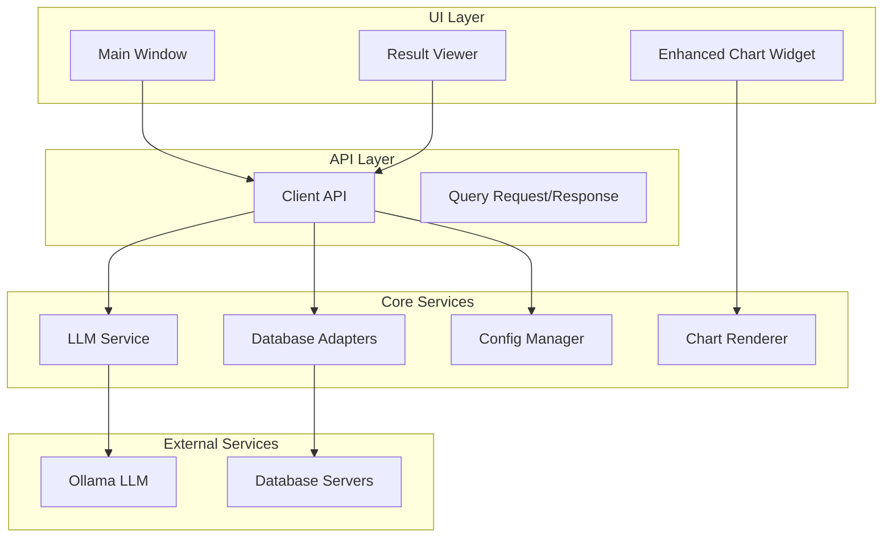

# 🔧 InsightPilot API Reference

> **Complete technical reference for InsightPilot's internal APIs and extensibility**

## 📋 Table of Contents

1. [Architecture Overview](#architecture-overview)
2. [Client API](#client-api)
3. [Database Adapters](#database-adapters)
4. [LLM Integration](#llm-integration)
5. [Visualization Engine](#visualization-engine)
6. [Configuration Management](#configuration-management)
7. [Extension Points](#extension-points)
8. [Server Mode API](#server-mode-api)

---

## 🏗️ Architecture Overview

### Component Diagram



### Key Principles

- **Separation of Concerns**: Clear boundaries between UI, logic, and data layers
- **Plugin Architecture**: Extensible through adapters and providers
- **Type Safety**: Comprehensive type annotations throughout
- **Error Handling**: Graceful degradation and comprehensive logging
- **Performance**: Asynchronous operations and connection pooling

---

## 🔌 Client API

### `ClientAPI` Class

The main interface between UI components and backend services.

#### Initialization

```python
from api.client_api import ClientAPI
from config.config_manager import ConfigManager

config_manager = ConfigManager()
client_api = ClientAPI(config_manager)
```

#### Core Methods

##### Query Execution

```python
def execute_natural_language_query_with_progress(
    self, 
    request: QueryRequest, 
    progress_callback: Optional[Callable[[str], None]] = None,
    table_callback: Optional[Callable[[str], None]] = None
) -> QueryResponse:
    """
    Execute natural language query with real-time progress updates.
    
    Args:
        request: QueryRequest object containing question and database info
        progress_callback: Function to call with progress messages
        table_callback: Function to call when tables are discovered
        
    Returns:
        QueryResponse with results, SQL, and execution metadata
        
    Raises:
        ConnectionError: When database connection fails
        ValidationError: When query validation fails
        TimeoutError: When query execution times out
    """
```

**Example Usage:**
```python
from api.client_api import QueryRequest

def progress_handler(message: str):
    print(f"Progress: {message}")

def table_handler(table_name: str):
    print(f"Found table: {table_name}")

request = QueryRequest(
    database_name="sales_db",
    question="Show me total sales by month",
    database_type="mysql"
)

response = client_api.execute_natural_language_query_with_progress(
    request, 
    progress_callback=progress_handler,
    table_callback=table_handler
)

if response.success:
    print(f"Query: {response.sql_query}")
    print(f"Rows: {response.result.row_count}")
else:
    print(f"Error: {response.error}")
```

##### Database Management

```python
def connect_to_database(self, database_name: str) -> bool:
    """
    Establish connection to specified database.
    
    Args:
        database_name: Name of database configuration
        
    Returns:
        True if connection successful, False otherwise
    """

def get_database_connections(self) -> Dict[str, Any]:
    """
    Get all configured database connections.
    
    Returns:
        Dictionary of connection configurations
    """

def get_database_schema(self, database_name: str) -> List[TableSchema]:
    """
    Retrieve schema information for database.
    
    Args:
        database_name: Database to analyze
        
    Returns:
        List of TableSchema objects
        
    Raises:
        ConnectionError: If not connected to database
    """
```

### Data Structures

#### `QueryRequest`

```python
@dataclass
class QueryRequest:
    """Query request structure"""
    database_name: str          # Database connection name
    question: str              # Natural language question
    database_type: str = "mysql"  # Database type (mysql, oracle, mongodb)
```

#### `QueryResponse`

```python
@dataclass
class QueryResponse:
    """Query response structure"""
    success: bool                      # Execution success flag
    sql_query: str                    # Generated SQL query
    result: Optional[QueryResult]     # Query results if successful
    explanation: str                  # AI-generated explanation
    error: Optional[str] = None       # Error message if failed
    execution_time: float = 0.0       # Total execution time in seconds
```

#### `QueryResult`

```python
@dataclass
class QueryResult:
    """Database query result structure"""
    columns: List[str]               # Column names
    rows: List[List[Any]]           # Result data rows
    row_count: int                  # Total number of rows
    execution_time: float           # Query execution time
    error: Optional[str] = None     # Database error if any
```

---

## 🗄️ Database Adapters

### Adapter Architecture

All database adapters inherit from `BaseDBAdapter` and implement a common interface:

```python
from abc import ABC, abstractmethod
from typing import List, Optional
from dataclasses import dataclass

class BaseDBAdapter(ABC):
    """Base class for database adapters"""
    
    @abstractmethod
    def connect(self) -> bool:
        """Establish database connection"""
        pass
    
    @abstractmethod
    def disconnect(self) -> None:
        """Close database connection"""
        pass
    
    @abstractmethod
    def execute_query(self, query: str) -> QueryResult:
        """Execute SQL query and return results"""
        pass
    
    @abstractmethod
    def get_schema(self) -> List[TableSchema]:
        """Get database schema information"""
        pass
    
    @abstractmethod
    def sanitize_query(self, query: str) -> str:
        """Validate and sanitize query for security"""
        pass
```

### MySQL Adapter

```python
from adapters.mysql_adapter import MySQLAdapter
from adapters.base_adapter import DBConnection

connection = DBConnection(
    host="localhost",
    port=3306,
    username="user",
    password="password",
    database="sales_db"
)

adapter = MySQLAdapter(connection)
if adapter.connect():
    schema = adapter.get_schema()
    result = adapter.execute_query("SELECT * FROM customers LIMIT 10")
```

**Features:**
- Connection pooling
- Prepared statements
- Transaction support
- SSL connections
- Query timeout handling

### Oracle Adapter

```python
from adapters.oracle_adapter import OracleAdapter

# Oracle-specific features
connection = DBConnection(
    host="oracle.company.com",
    port=1521,
    username="hr_user",
    password="password",
    database="HR",
    extra_params={"service_name": "HRDB"}
)

adapter = OracleAdapter(connection)
```

**Features:**
- TNS name resolution
- Wallet authentication
- Advanced data types
- PL/SQL procedure support
- RAC cluster support

### MongoDB Adapter

```python
from adapters.mongo_adapter import MongoAdapter

# MongoDB uses different query paradigm
adapter = MongoAdapter(connection)
# Converts SQL-like queries to MongoDB aggregation pipelines
```

**Features:**
- Aggregation pipeline generation
- Document schema inference
- Index optimization recommendations
- GridFS file handling

### Custom Adapter Development

To add support for a new database:

```python
from adapters.base_adapter import BaseDBAdapter, QueryResult, TableSchema

class CustomDBAdapter(BaseDBAdapter):
    def __init__(self, connection: DBConnection):
        super().__init__(connection)
        self.client = None
    
    def connect(self) -> bool:
        try:
            # Implement connection logic
            self.client = custom_db_connect(
                self.connection.host,
                self.connection.port,
                # ... other params
            )
            return True
        except Exception as e:
            self.logger.error(f"Connection failed: {e}")
            return False
    
    def execute_query(self, query: str) -> QueryResult:
        # Implement query execution
        # Return QueryResult object
        pass
    
    def get_schema(self) -> List[TableSchema]:
        # Implement schema discovery
        # Return list of TableSchema objects
        pass
```

---

## 🤖 LLM Integration

### LLM Client Factory

```python
from llm.llm_client import create_llm_client
from config.config_manager import ConfigManager

config_manager = ConfigManager()

# Create enhanced LLM client (supports multiple providers)
llm_client = create_llm_client(config_manager, legacy_mode=False)

# Create legacy client (Ollama only)
llm_client = create_llm_client(None, legacy_mode=True)
```

### Enhanced LLM Client

The `EnhancedLLMClient` supports multiple LLM providers:

```python
from llm.enhanced_llm_client import EnhancedLLMClient

class EnhancedLLMClient:
    def generate_sql(self, schema_info: str, question: str) -> LLMResponse:
        """Generate SQL query from natural language"""
        
    def generate_mongodb_query(self, schema_info: str, question: str) -> LLMResponse:
        """Generate MongoDB aggregation pipeline"""
        
    def explain_query(self, query: str) -> LLMResponse:
        """Generate human-readable query explanation"""
        
    def recommend_chart(self, columns: List[str], sample_data: List[List[Any]], 
                       question: str, user_hint: str = "") -> LLMResponse:
        """Recommend optimal chart type and configuration"""
        
    def health_check(self) -> bool:
        """Check if LLM service is available"""
        
    def list_models(self) -> Dict[str, Any]:
        """Get available models from provider"""
```

### Provider Configuration

#### Ollama Provider
```python
ollama_config = {
    "provider": "ollama",
    "base_url": "http://localhost:11434",
    "model": "mistral:7b",
    "timeout": 30
}
```

#### OpenAI Provider
```python
openai_config = {
    "provider": "openai",
    "api_key": "your-api-key",
    "model": "gpt-4",
    "max_tokens": 1000
}
```

#### Custom Provider
```python
from llm.providers.base_provider import BaseLLMProvider

class CustomLLMProvider(BaseLLMProvider):
    def __init__(self, config: Dict[str, Any]):
        super().__init__(config)
        
    def generate_response(self, prompt: str) -> LLMResponse:
        # Implement custom LLM integration
        pass
    
    def health_check(self) -> bool:
        # Implement health check
        pass
```

### Prompt Templates

The system uses structured prompts for different tasks:

```python
from llm.prompt_builder import PromptBuilder

prompt_builder = PromptBuilder()

# SQL generation prompt
sql_prompt = prompt_builder.build_sql_prompt(schema_info, question)

# Chart recommendation prompt  
chart_prompt = prompt_builder.build_chart_prompt(columns, sample_data, question)

# Custom prompt
custom_prompt = prompt_builder.build_custom_prompt(
    template="custom_analysis",
    variables={"data": data, "context": context}
)
```

---

## 📊 Visualization Engine

### Chart Renderer

The `ChartRenderer` class handles all chart generation:

```python
from visualization.chart_renderer import ChartRenderer
from adapters.base_adapter import QueryResult

renderer = ChartRenderer()

# Automatic chart type inference
chart_bytes = renderer.render_chart(
    result=query_result,
    chart_type=None,  # Auto-detect
    title="Sales Analysis",
    figsize=(12, 8),
    dpi=300
)

# Specific chart type
chart_bytes = renderer.render_chart(
    result=query_result,
    chart_type="bar",
    title="Revenue by Category",
    color="steelblue",
    alpha=0.8
)
```

### Enhanced Chart Widget

The `EnhancedChartArea` provides zoom and pan functionality:

```python
from ui.widgets.enhanced_chart_widget import EnhancedChartArea

chart_area = EnhancedChartArea()

# Display chart with zoom capabilities
chart_area.display_chart(chart_bytes)

# Programmatic zoom control
chart_area.zoom_in()
chart_area.zoom_out()
chart_area.fit_to_view()
chart_area.reset_zoom()
```

### Chart Types and Features

#### Supported Chart Types

```python
CHART_TYPES = {
    'bar': 'Bar Chart',
    'line': 'Line Chart', 
    'pie': 'Pie Chart',
    'scatter': 'Scatter Plot',
    'histogram': 'Histogram',
    'table': 'Data Table'
}
```

#### Chart Customization Options

```python
chart_options = {
    'figsize': (10, 6),          # Figure size in inches
    'dpi': 300,                  # Resolution for export
    'color': 'steelblue',        # Primary color
    'alpha': 0.8,                # Transparency
    'title': 'Custom Title',     # Chart title
    'xlabel': 'X Axis Label',    # X-axis label
    'ylabel': 'Y Axis Label',    # Y-axis label
    'grid': True,                # Show grid lines
    'legend': True,              # Show legend
    'style': 'default'           # Matplotlib style
}
```

### Adding Custom Chart Types

```python
from visualization.chart_renderer import ChartRenderer

class CustomChartRenderer(ChartRenderer):
    def __init__(self):
        super().__init__()
        # Add custom chart type
        self.chart_types['heatmap'] = self._render_heatmap
    
    def _render_heatmap(self, ax, result: QueryResult, title: str, **kwargs):
        """Render custom heatmap chart"""
        # Implementation here
        pass
```

---

## ⚙️ Configuration Management

### ConfigManager Class

Centralized configuration management with encryption:

```python
from config.config_manager import ConfigManager

config_manager = ConfigManager()

# Database connections
connections = config_manager.get_database_connections()
config_manager.add_database_connection("prod_db", connection_info)
config_manager.remove_database_connection("old_db")

# LLM settings
llm_settings = config_manager.get_llm_settings()
config_manager.update_llm_settings({"model": "gpt-4", "temperature": 0.1})

# UI preferences
ui_settings = config_manager.get_ui_settings()
config_manager.update_ui_settings({"theme": "dark", "font_size": 12})
```

### Configuration Structure

```python
config_structure = {
    "database_connections": {
        "connection_name": {
            "type": "mysql|oracle|mongodb",
            "host": "server_address",
            "port": 3306,
            "database": "database_name",
            "username": "user",
            "password": "encrypted_password",
            "extra_params": {}
        }
    },
    "llm_settings": {
        "provider": "ollama|openai|custom",
        "model": "model_name",
        "base_url": "http://localhost:11434",
        "api_key": "encrypted_key",
        "timeout": 30,
        "temperature": 0.1
    },
    "ui_settings": {
        "theme": "light|dark|auto",
        "font_size": 11,
        "window_geometry": "100,100,1200,800",
        "show_animations": True
    }
}
```

### Secure Storage

Passwords and API keys are encrypted using platform-specific secure storage:

```python
# Windows: DPAPI
# macOS: Keychain
# Linux: Secret Service API

from config.secure_storage import SecureStorage

storage = SecureStorage()
storage.store_password("db_password", "secret123")
password = storage.retrieve_password("db_password")
```

---

## 🔌 Extension Points

### Plugin Architecture

InsightPilot supports plugins for extending functionality:

```python
from plugins.base_plugin import BasePlugin

class CustomAnalysisPlugin(BasePlugin):
    name = "Custom Analysis"
    version = "1.0.0"
    description = "Custom data analysis tools"
    
    def initialize(self):
        """Called when plugin is loaded"""
        pass
    
    def get_menu_items(self):
        """Return menu items to add"""
        return [
            {"text": "Custom Analysis", "callback": self.run_analysis}
        ]
    
    def run_analysis(self):
        """Plugin-specific functionality"""
        pass
```

### Custom Database Adapter

```python
from adapters.base_adapter import BaseDBAdapter

class RedisAdapter(BaseDBAdapter):
    """Example: Redis database adapter"""
    
    def connect(self) -> bool:
        # Redis connection logic
        pass
    
    def execute_query(self, query: str) -> QueryResult:
        # Convert SQL to Redis commands
        pass
```

### Custom LLM Provider

```python
from llm.providers.base_provider import BaseLLMProvider

class HuggingFaceProvider(BaseLLMProvider):
    """Example: Hugging Face model provider"""
    
    def generate_response(self, prompt: str) -> LLMResponse:
        # Hugging Face API integration
        pass
```

### UI Extensions

```python
from ui.extensions.base_extension import BaseUIExtension

class DataQualityExtension(BaseUIExtension):
    """Example: Data quality analysis extension"""
    
    def add_to_ui(self, main_window):
        # Add custom UI components
        pass
```

---

## 🌐 Server Mode API

### gRPC Service Definition

```protobuf
// insightpilot.proto
syntax = "proto3";

service InsightPilotService {
    rpc ExecuteQuery(QueryRequest) returns (QueryResponse);
    rpc GetDatabaseSchema(SchemaRequest) returns (SchemaResponse);
    rpc ListDatabases(Empty) returns (DatabaseListResponse);
    rpc HealthCheck(Empty) returns (HealthResponse);
}

message QueryRequest {
    string database_name = 1;
    string question = 2;
    string database_type = 3;
}

message QueryResponse {
    bool success = 1;
    string sql_query = 2;
    QueryResult result = 3;
    string explanation = 4;
    string error = 5;
    double execution_time = 6;
}
```

### Server Implementation

```python
from api.server_api import InsightPilotServer
import grpc
from concurrent import futures

# Start gRPC server
server = grpc.server(futures.ThreadPoolExecutor(max_workers=10))
service = InsightPilotServer(config_manager)
add_InsightPilotServiceServicer_to_server(service, server)

listen_addr = '[::]:50051'
server.add_insecure_port(listen_addr)
server.start()
print(f"Server listening on {listen_addr}")
server.wait_for_termination()
```

### Client Usage

```python
import grpc
from api.insightpilot_pb2_grpc import InsightPilotServiceStub
from api.insightpilot_pb2 import QueryRequest

# Connect to server
channel = grpc.insecure_channel('localhost:50051')
stub = InsightPilotServiceStub(channel)

# Execute query
request = QueryRequest(
    database_name="sales_db",
    question="Show me total sales by month",
    database_type="mysql"
)

response = stub.ExecuteQuery(request)
if response.success:
    print(f"Results: {response.result.row_count} rows")
else:
    print(f"Error: {response.error}")
```

---

## 🔍 Error Handling

### Exception Hierarchy

```python
class InsightPilotError(Exception):
    """Base exception for InsightPilot"""
    pass

class DatabaseError(InsightPilotError):
    """Database-related errors"""
    pass

class LLMError(InsightPilotError):
    """LLM service errors"""
    pass

class ValidationError(InsightPilotError):
    """Query validation errors"""
    pass

class ConfigurationError(InsightPilotError):
    """Configuration-related errors"""
    pass
```

### Error Response Format

```python
@dataclass
class ErrorResponse:
    error_code: str
    error_message: str
    error_type: str
    timestamp: datetime
    context: Dict[str, Any]
```

---

## 📊 Performance Monitoring

### Metrics Collection

```python
from monitoring.metrics import MetricsCollector

metrics = MetricsCollector()

# Query performance
metrics.record_query_time("sales_analysis", 2.5)
metrics.record_query_success("customer_report")
metrics.record_query_failure("complex_join", "timeout")

# System performance
metrics.record_memory_usage(1024)  # MB
metrics.record_cpu_usage(45)       # Percentage
```

### Health Checks

```python
from monitoring.health import HealthChecker

health_checker = HealthChecker()
health_status = health_checker.check_all()

# Returns:
{
    "database_connections": "healthy",
    "llm_service": "healthy", 
    "memory_usage": "warning",
    "disk_space": "healthy"
}
```

---

## 🧪 Testing

### Unit Tests

```python
import pytest
from api.client_api import ClientAPI
from config.config_manager import ConfigManager

@pytest.fixture
def client_api():
    config = ConfigManager()
    return ClientAPI(config)

def test_database_connection(client_api):
    # Test database connection functionality
    result = client_api.connect_to_database("test_db")
    assert result is True

def test_query_execution(client_api):
    # Test query execution
    request = QueryRequest(
        database_name="test_db",
        question="SELECT * FROM users LIMIT 5"
    )
    response = client_api.execute_query(request)
    assert response.success is True
```

### Integration Tests

```python
def test_end_to_end_query():
    """Test complete query workflow"""
    # Setup
    client_api = ClientAPI(ConfigManager())
    
    # Connect to database
    assert client_api.connect_to_database("test_db")
    
    # Execute query
    request = QueryRequest(
        database_name="test_db",
        question="Show me all users"
    )
    response = client_api.execute_query(request)
    
    # Verify results
    assert response.success
    assert len(response.result.rows) > 0
    assert len(response.result.columns) > 0
```

---

<div align="center">

**🎯 Ready to Extend InsightPilot?**

This API reference provides the foundation for building custom adapters, providers, and extensions.

[← User Guide](USER_GUIDE.md) | [Troubleshooting →](TROUBLESHOOTING.md)

</div>
